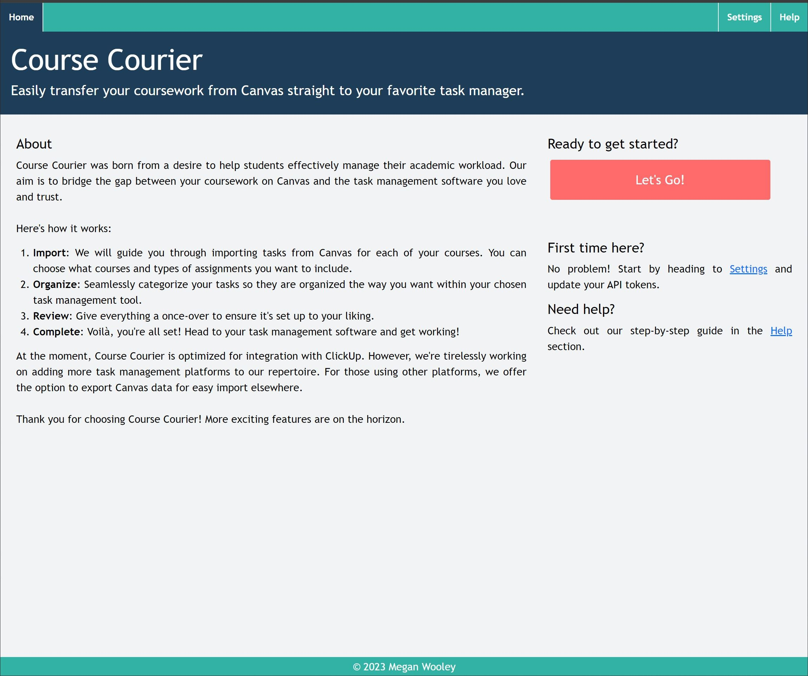
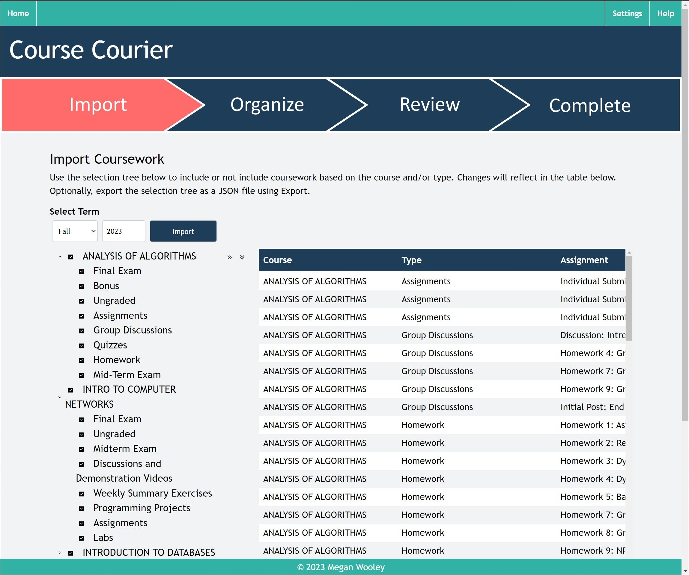
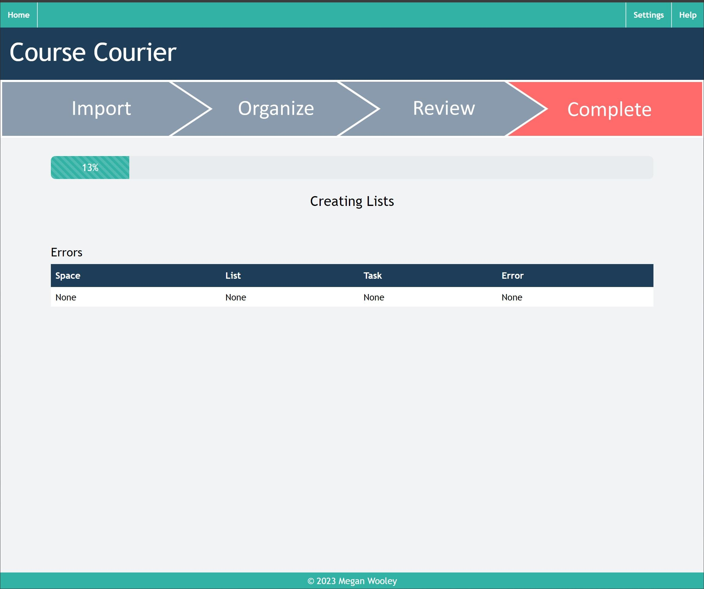
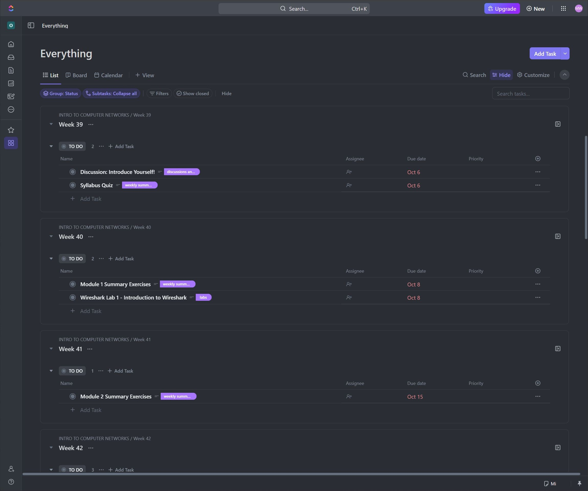

# Course Courier

Course Courier is an application designed to streamline the process of managing academic assignments. Canvas is weidely used web-based learning management system where students can find and submit their assigned coursework. While it provides some task management capabilities, task managment is not one size fits all and everyone has their own preferences and preferred softwares for how they manage their tasks. This is where Course Courier comes in. Course Courier enables its users to copy their coursework from Canvas to the task management software of their chocie. Users can filter the assignments they want to copy and tailor how it will be organized in their task management software.

At the moment, Course Courier is optimized for integration with ClickUp. However, I would love to add more task management software integrations down the road. For those using other platforms, you can export Canvas data for easy import elsewhere.

## Project Background

I developed this application as part of portfolio assignment for Software Engineering I this past Fall. The idea for this was born out of a personal need to make assignment tracking more efficient. I found the process of migrating school tasks from Canvas to other systems tedious and time consuming and wanted to build a tool that autoamted the process, turning this activity into one that takes hours to one that takes minutes.

This project is definietly bigger than what the portfolio assignment called for, but I had a lot of fun building it out. I would love to one day host this publically, but for now it just runs locally as a personal tool. This is in part to comply with Canvas' API Terms and Conditions and also because I am not ready to manage secrets and tokens.

## Try It Out

1. **Fork the Repository**: Start by forking the repo to get your own copy.
2. **Environment Setup**: Ensure to set up your `.env` files in the `course-courier-rest` folder. Follow the instructions provided in the two template files.
3. **Running the Application**:
    - Run the REST controller first.
    - Following that, run the React application.

## Contribution and Feedback

There is definitely room for improvement in this project. It would be great to improve the seamlessness of the application as well as support integration of other task managment softwares. If you're interested in contributing or trying out Course Courier, feel free to fork the repository and explore its capabilities. Your feedback and contributions are highly appreciated!

## Disclaimer

Please note that this project is intended for personal use. It is essential to comply with Canvas' API Terms and Conditions when using this application. 

## Contact

For any queries or suggestions, please feel free to reach out through the project's GitHub repository.
